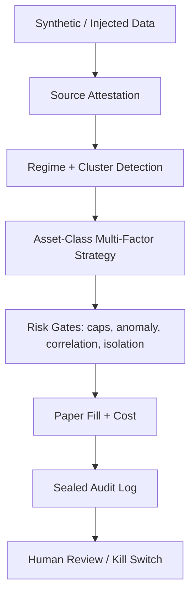

# Architecture (v0.50)

```mermaid
flowchart TD
    A[Synthetic / Injected Data] --> B[Source Attestation]
    B --> C[Regime + Cluster Detection]
    C --> D[Asset-Class Multi-Factor Strategy]
    D --> E[Risk Gates: caps, anomaly, correlation, isolation]
    E --> F[Paper Fill + Cost]
    F --> G[Sealed Audit Log]
    G --> H[Human Review / Kill Switch]
```

Zero-trust boundaries enforced throughout. AI-agent harness gates in CI.
